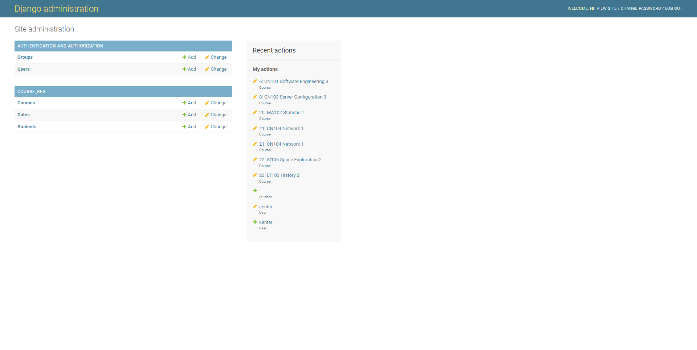

# cn331-as2

# สมาชิกกลุ่ม

นายบุลากร จั่นบุญมี 6310682577

นายคมชาญ สาสนทาญาติ 6310682684

### หน้า login

##### โดยถ้า user ที่ login เป็น 
- admin จะทำการ link ไป หน้า admin
- user จะทำการ link ไปหน้า user

##### ในส่วนของหน้า admin จะเป็นการ

- แก้ไขหรือเพิ่มรายวิชา section
  
- แก้ไขหรือเพิ่ม student
  
- สร้าง user
  

##### ในส่วนของหน้า user จะมี 3 ส่วน
ในทุกๆ ส่วนจะมีปุ่ม logout สำหรับการ logout ทางขวาบน

1. **Index**
เป็นหน้าหลักใช้บอก Username และ Email ของ user

2. **Course Enrolled**
บอกชื่อรหัสวิชา ชื่อรายวิชา และ section ที่ลงทะเบียนเรียน 
โดยมีปุ่มกลับไปหน้าหลักอยู่ตรงกลาง

3. **Register**
มีปุ่มกลับไปหน้าหลักและช่องสำหรับค้นหาอยู่ตรงกลาง
เป็นหน้าลงทะเบียนเรียนโดยจะแบ่งเป็น 2 ส่วน
   1. ส่วนแสดงวิชาที่ลงทะเบียนแล้ว
    
   2. ส่วนที่แสดงรายวิชาที่สามารถลงทะเบียนได้
    
